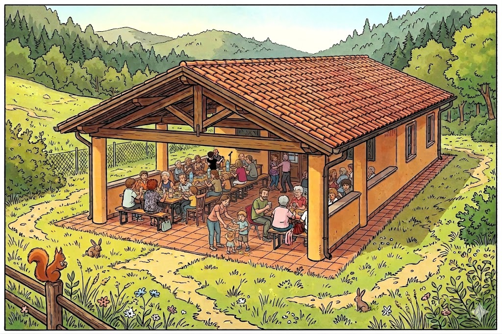

# Indicazioni per la casetta del bosco della città di Rovereto

# Data e ora dell'evento

Sabato 13 giugno, dalle 12.00 in poi

# Come raggiungere il luogo

Si consiglia di non seguire le indicazioni suggerite di Google Maps, che fa passare da Volano.

Il percorso suggerito da noi è questo: arrivati alla stazione dei treni di Rovereto, girare per via Rosmini e in fondo a questa via seguire le indicazioni per il Bosco della Città. Di seguito il link da usare con Google Maps.

[Questo è il link a Google Maps con il percorso descritto](https://maps.app.goo.gl/BM73fRmyngVccybcA)

# Dove parcheggiare

Ci sono due parcheggi vicino alla casetta, sono indicati qui:

 * [Parcheggio 1](https://maps.app.goo.gl/j1GGgcxqP7rRFznb9)
 * [Parcheggio 2](https://maps.app.goo.gl/XkTeZQToCqiTGtCcA)

